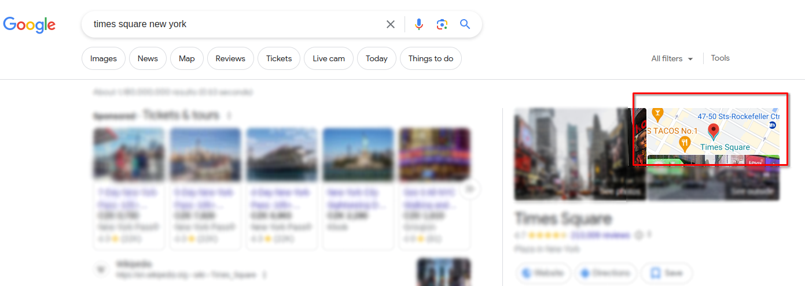

# Add missing link to map thumbnail element in Google Search for EU users.

## Installation

### 1. Install Tampermonkey browser extension

https://www.tampermonkey.net/

-   Chrome extension: https://chromewebstore.google.com/detail/tampermonkey/dhdgffkkebhmkfjojejmpbldmpobfkfo
-   Firefox extension: https://addons.mozilla.org/en-US/firefox/addon/tampermonkey/
-   Safari extension: https://apps.apple.com/us/app/tampermonkey/id1482490089

### 2. Install script

1. Copy the content of [index.js](./index.js)
2. Place the copied content into Tampermonkey extension using `Create a new script` button
3. 🎉

## Screenshots

